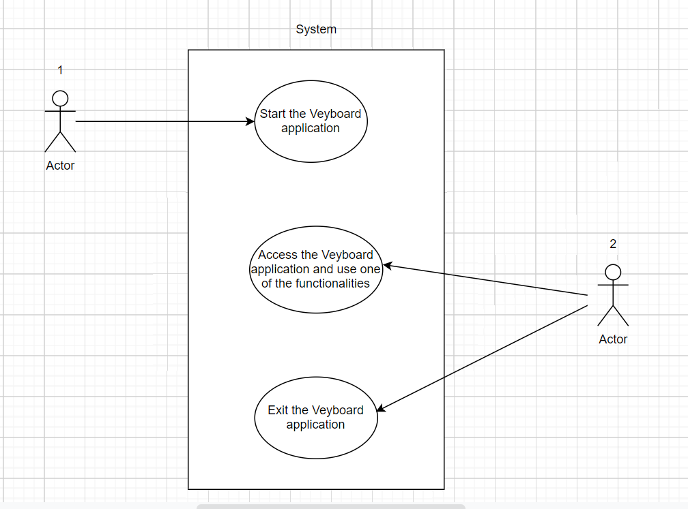
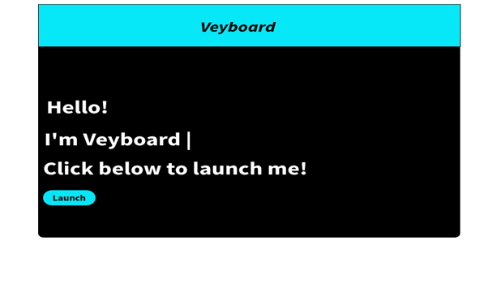
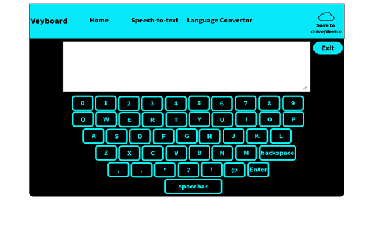
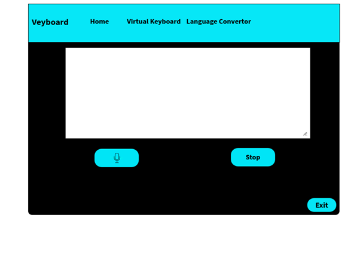
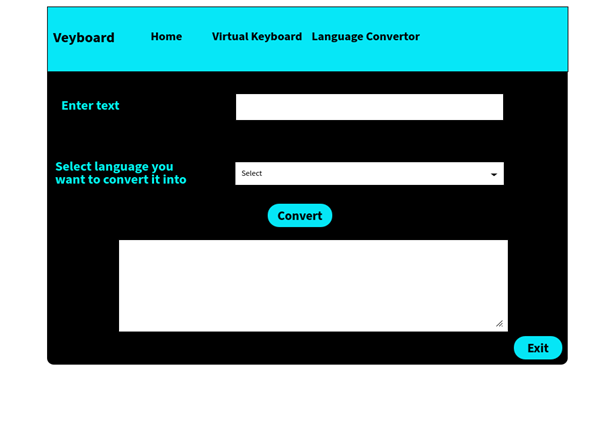
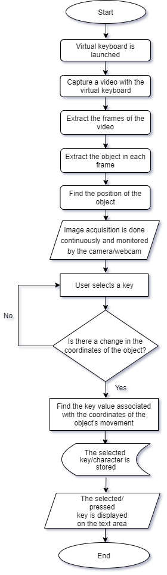
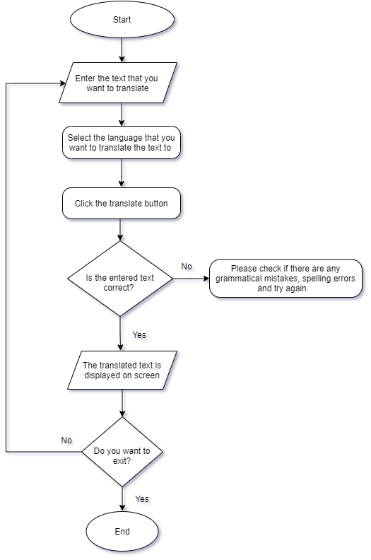
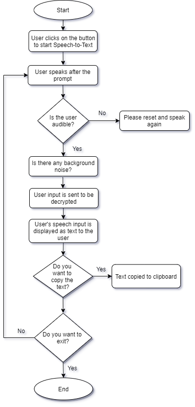

# Veyboard

        

## Aims and Objectives
The aim of this project is to build a virtual keyboard that makes use of hand gestures to feed input into the computer.

The objectives of this project are:
1. To improve human computer interaction technologies.
2. To build a virtual keyboard that takes the hand gestures/ object movement to feed input into the computer. The moving object acts as our cursor in the display area.
3. To display the keys being pressed in the given text area in real time.
4. To make a virtual keyboard that works efficiently and is user-friendly.
5. To make a virtual keyboard that is secure enough and prevents the theft of any data.
6. To make a virtual keyboard that would eventually be deployed and could be integrated with other websites.

## Scope of this project
1. To develop a virtual keyboard which overcomes the issue of keystroke logging and protects account passwords from vicious spyware and trojan programs during login.
2. To lower the risk of passwords getting stolen.
3. To implement a Speech-to-Text converter for ease of access (accessibility feature which makes use of assistive technology).
4. To implement a language translating tool to convert text into different languages.

## Functional Requirements
- System must launch the keyboard properly.
- System keyboard must be a “QWERTY” keyboard. The first row of alphabets on the keyboard should start with ‘Q’, ‘W’, ‘E’, ‘R’, ‘T’ and ‘Y’.
- System must capture images via camera.
- System must be able to segment the image of the object properly.
- System must find the correct coordinates of the object (tracking the object 's movements).
- System must allow the user to "click" on the key.
- System must display the text /key entered only if the object is hovering above it.
- System must display the correct output for the key entered by the user.
- System must display all the available languages to which the entered text can be translated to.
- System must display the closest possible translation of the text entered by the user (based on the language selected by the user).
- System must display the closest understanding of the speech input given by the user.

## Non-functional Requirements

- **Size -** The size of the keyboard should not be more than 75%.

- **UX /Accessibility/Usability -** The UX of the project should be easy enough for the users to navigate comfortably through the web pages. In other words, the user should be able to find out which buttons perform what actions.

- **Security -** The keyboard must be secure enough to block keyloggers from capturing the key strokes.

- **Performance -** There should not be a lag while using the system. The expected output should be displayed within the specific time frame and it must be able to handle a specific number of users (load).

- **Reliability -** System should be reliable enough to handle multiple keystrokes without failing. Each key entered must be captured individually and displayed correctly on the screen.

## Use case Diagram

## Architecture

### Hardware Architecture
The hardware components of this project are mainly a laptop or a PC with an operational webcam and a microphone. The hand gestures are detected by the webcam with the help of the colored tape which should be distinguishable, i.e. the tape’s colors could be yellow, red and blue. They are supposed to be placed at the fingertips.

### Software Architecture
In this project, the user has to wrap coloured tapes (preferable colours being red, blue and yellow) on their fingertips which would be detected by the camera for the purpose of data input into the virtual keyboard. Thus, through the use of a particular hand gesture, sentences or phrases can be entered into the keyboard without a touch interface. Through this, the Veyboard technology comes under the concept of Human Computer Interaction (HCI).

- **Virtual Keyboard**
In the virtual keyboard functionality, the user has to click on the power on button, which is located on the bottom right of the screen, to enable the hand gestures functionality of the keyboard after launching the Veyboard project. After this, the webcam is switched on for segmenting of the coloured tapes. One has to hold their fingertips and press the spacebar key to record that value. This is done by the window which holds the trackbars from which the user can manually segment the colours. This is followed by masking of the image which extracts the portions needed in that image. Gaussian filtering is done after masking to remove high frequency components and contouring which approximates the shapes of the coloured fingertips. Then, it starts to track the movements of the coloured fingertips. After all this is done, a window pops up in which if one presses the ‘C’ key, they can see the centroids of the colours and by pressing ‘P’, one can start the hand gesture simulation. The yellow colour is used for free movement and the red and blue colour is used for clicking/pressing gestures.
All this is done using OpenCV. PyAutoGUI libraries in Python and ReactJS for the making of the keyboard.

- **Language Translation**
In language translation, the text entered by the user is translated to the target language as per the user’s choice. The translated text is then displayed on screen.
This code is responsible for the language translation feature of the project. The module first detects the language of the data (sentences or phrases) which is typed into the text box and then, it is translated to language desired by the user. It makes use of the google_trans_new library in Python. It implements the Google Translate API to make calls to methods such as detect() and translate().  It supports approximately 106 different languages.

- **Speech-To-Text**
The user provides voice input to the system which is then translated into text. The application waits for the user to finish speaking and then displays the spoken text on screen.
This part of the code is responsible for the Speech-to-Text feature of the project. Firstly, it accepts the user input as speech or words spoken into the microphone, converts it into an electrical signal, then compares it with the phonemes. It makes use of the pyaudio and speech_recognition modules in python. Here, Google’s speech is directly used to help with understanding part of the signal, i.e. what the user says.
Using the phonemes, it understands the words and tries to offer the closest response to what the user might have said.

## Wireframes
### Homepage wireframe (Screen 1)

### Keyboard wireframe (Screen 2)

### Speech-to-text wireframe (Screen 3)

### Language Translation wireframe (Screen 4)

## System Design
### System Flowcharts
- #### Flowchart for Virtual keyboard

- #### Flowchart for Language Translation

- #### Flowchart for Speech To Text

